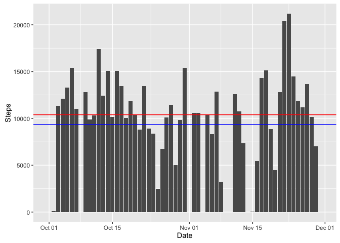
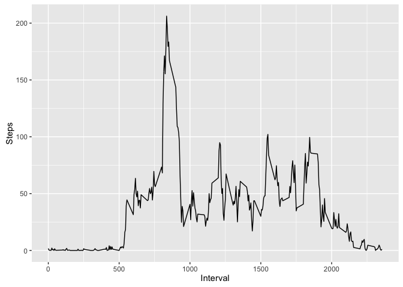
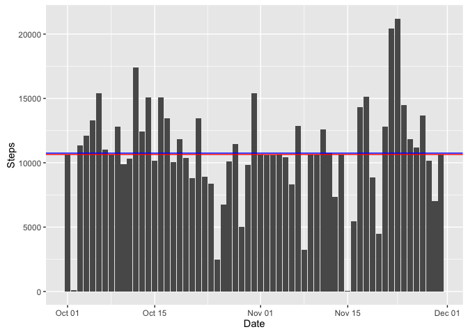
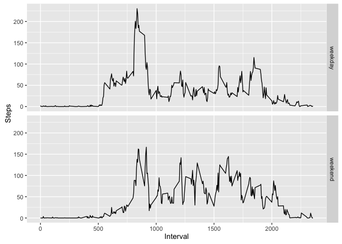

# Reproducible Research: Peer Assessment 1

## Dependencies for the project

Include libraries for data manipulation and plotting.


```r
# install.packages(c('dplyr', 'ggplot2', 'chron'))
library('dplyr')
library('ggplot2')
library('chron')
```

## Loading and preprocessing the data

Check if file exists or unzip **activity.zip** file.


```r
if (file.exists('activity.csv') == FALSE) {
    unzip('activity.zip')
}
```

Check if variable already created or read the **activity.csv** file.


```r
if (exists('activity_data') == FALSE) {
    activity_data <- read.csv('activity.csv')
}
```

Format date.


```r
activity_data$date = as.Date(as.character(activity_data$date))
```

## What is mean total number of steps taken per day?

Group data and calculate total of steps per date.


```r
by_day_activity_data <- summarise(
    group_by(activity_data, date),
    sum(steps, na.rm=TRUE))
names(by_day_activity_data) <- c('Date', 'Steps')
```

Plot histogram total of steps per date.


```r
plot1 <- ggplot(by_day_activity_data, aes(x=Date, y=Steps)) +
    geom_bar(stat='identity') +
    geom_hline(aes(yintercept = mean(Steps)), col = 'blue') +
    geom_hline(aes(yintercept = median(Steps)), col = 'red')
print(plot1)
```

 

Mean total number of steps per date.


```r
mean(by_day_activity_data$Steps, na.rm = TRUE)
```

```
## [1] 9354.23
```

Median total number of steps per date.


```r
median(by_day_activity_data$Steps, na.rm = TRUE)
```

```
## [1] 10395
```

## What is the average daily activity pattern?

Group data and calculate total of steps per interval.


```r
by_interval_activity_data <- summarise(
    group_by(activity_data, interval),
    mean(steps, na.rm=TRUE))
names(by_interval_activity_data) <- c('Interval', 'Steps')
```

Plot time serie average of steps by per interval.


```r
plot2 <- ggplot(by_interval_activity_data, aes(x=Interval, y=Steps)) +
    geom_line()
print(plot2)
```

 

Max number of average of steps on a 5 minute interval.


```r
max_steps_by_interval <- which.max(by_interval_activity_data$Steps)
by_interval_activity_data[max_steps_by_interval, ]
```

```
## Source: local data frame [1 x 2]
## 
##   Interval    Steps
##      (int)    (dbl)
## 1      835 206.1698
```

## Imputing missing values

Total missing values.


```r
sum(is.na(activity_data$steps))
```

```
## [1] 2304
```

Use mean of interval as integer for imputing missing values.


```r
activity_imputed_data <- activity_data
activity_imputed_data$steps <- with(
    activity_imputed_data,
    ifelse(
        is.na(steps),
        as.integer(by_interval_activity_data[
            by_interval_activity_data$Interval == interval
        ]$Steps),
        as.integer(steps)
    )
)
```

Group data and calculate total of steps per date.


```r
by_day_activity_imputed_data <- summarise(
    group_by(activity_imputed_data, date),
    sum(steps, na.rm=TRUE))
names(by_day_activity_imputed_data) <- c('Date', 'Steps')
```

Plot histogram total of steps per date.


```r
plot3 <- ggplot(by_day_activity_imputed_data, aes(x=Date, y=Steps)) +
    geom_bar(stat='identity') +
    geom_hline(aes(yintercept = mean(Steps)), col = 'blue') +
    geom_hline(aes(yintercept = median(Steps)), col = 'red')
print(plot3)
```

 

Mean total number of steps per date compared with not imputted data.


```r
mean(by_day_activity_imputed_data$Steps, na.rm = TRUE)
```

```
## [1] 10749.77
```

```r
mean(by_day_activity_data$Steps, na.rm = TRUE)
```

```
## [1] 9354.23
```

Median total number of steps per date compared with not imputted data.


```r
median(by_day_activity_imputed_data$Steps, na.rm = TRUE)
```

```
## [1] 10641
```

```r
median(by_day_activity_data$Steps, na.rm = TRUE)
```

```
## [1] 10395
```

## Are there differences in activity patterns between weekdays and weekends?

Add weekend / weekday factor.


```r
activity_imputed_data <- mutate(
    activity_imputed_data,
    week = ifelse(
        is.weekend(date),
        'weekend',
        'weekday'
    )
)
activity_imputed_data$week <- as.factor(activity_imputed_data$week)
```

Group data by weekday and calculate total of steps per interval.


```r
by_interval_activity_weekday_data <- activity_imputed_data %>%
    group_by(week, interval) %>%
    select(week, interval, steps) %>%
    summarise(mean(steps, na.rm=TRUE))
names(by_interval_activity_weekday_data) <-
    c('Weekday', 'Interval', 'Steps')
```

Plot time serie average of steps by per interval separated by weekend and weekday.


```r
plot4 <- ggplot(
        by_interval_activity_weekday_data,
        aes(x=Interval, y=Steps)) +
    facet_grid(Weekday ~ .) +
    geom_line()
print(plot4)
```

 
